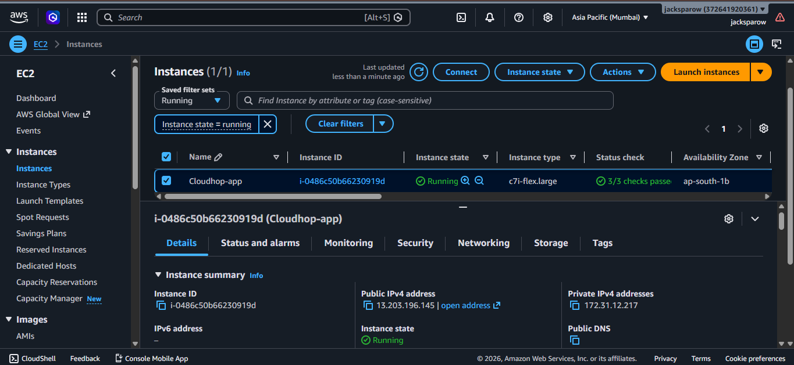
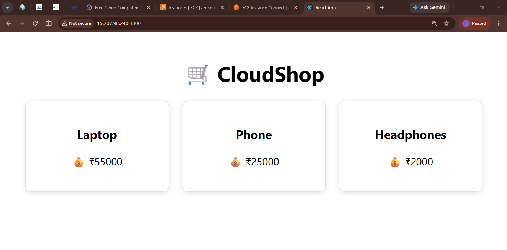
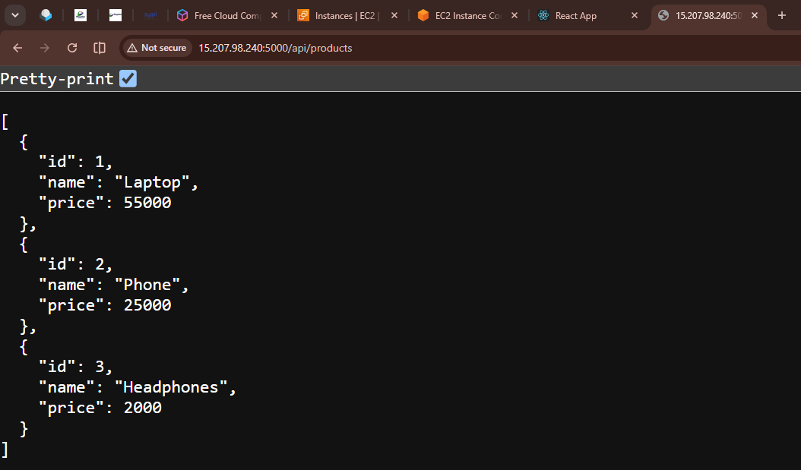

<h1 align="center">🚀 CloudShop</h1>

<p align="center">
A Dockerized Full Stack E-Commerce Application deployed on <b>AWS EC2</b> using <b>Docker</b>, <b>Terraform</b>, <b>Linux</b> and <b>GitHub</b>.
</p>

<p align="center">


</p>

---

# 📖 Project Overview

CloudShop is a production-style Full Stack E-Commerce application developed to demonstrate **AWS DevOps deployment**, **Docker containerization**, **Terraform infrastructure provisioning**, and **Linux server administration**.

The project consists of:

- React Frontend
- Node.js + Express Backend
- Docker Containers
- Docker Compose
- AWS EC2 Deployment
- Terraform Infrastructure
- GitHub Version Control

---

# 🏗️ Architecture

```
                Internet
                    │
                    ▼
          AWS EC2 (Ubuntu Server)
                    │
         Docker Engine & Compose
                    │
      ┌─────────────┴─────────────┐
      │                           │
      ▼                           ▼
 React Frontend              Node Backend
   (Nginx)                     Express API
      │                           │
      └─────────────┬─────────────┘
                    │
               REST API
```

---

## 📸 Application Output





---

# ☁️ Cloud Services Used

| Service | Purpose |
|----------|----------|
| Amazon EC2 | Virtual Server |
| Amazon EBS | Persistent Storage |
| Security Groups | Firewall Rules |
| Public IP | Application Access |

---

# 🛠 Tech Stack

| Category | Technology |
|----------|------------|
| Frontend | React.js |
| Backend | Node.js |
| API | Express.js |
| Containerization | Docker |
| Orchestration | Docker Compose |
| Cloud | AWS EC2 |
| Infrastructure as Code | Terraform |
| Operating System | Ubuntu Linux |
| Version Control | Git & GitHub |

---

# 📂 Project Structure

```
CloudShop/

├── backend/

│ ├── Dockerfile

│ ├── server.js

│ └── package.json

│

├── frontend/

│ ├── Dockerfile

│ ├── src/

│ └── package.json

│

├── terraform/

│ ├── main.tf

│ ├── variables.tf

│ └── output.tf

│

├── screenshots/

├── docker-compose.yml

├── .gitignore

└── README.md
```

---

# 🚀 Deployment Steps

## Clone Repository

```bash
git clone https://github.com/shubhamahire9168/Cloudshop.git

cd Cloudshop
```

---

## Build Docker Images

```bash
docker compose build
```

---

## Run Containers

```bash
docker compose up -d
```

---

## Verify Running Containers

```bash
docker ps
```

---

## Backend API

```
http://<EC2-PUBLIC-IP>:5000/api/products
```

---

## Frontend

```
http://<EC2-PUBLIC-IP>:3000
```

---

# 🔧 DevOps Activities Performed

✅ AWS EC2 Provisioning

✅ Ubuntu Server Configuration

✅ Docker Installation

✅ Docker Compose Installation

✅ Docker Image Build

✅ Multi-Container Deployment

✅ Terraform Infrastructure

✅ Linux Server Administration

✅ GitHub Version Control

✅ API Testing

✅ Troubleshooting

---

# 🐳 Docker Commands

```bash
docker compose build

docker compose up -d

docker compose down

docker ps

docker images

docker logs cloudshop-backend

docker logs cloudshop-frontend

docker system df

docker system prune -a
---

# ⚠️ Troubleshooting

### Docker Not Installed

```bash
sudo apt install docker.io
```

---

### Docker Compose Missing

```bash
sudo apt install docker-compose-v2
```

---

### No Space Left On Device

```bash
docker system prune -a
```

---

### GitHub Large File Error

Added:

```
.terraform/

node_modules/

.env

terraform.tfstate

*.pem

build/

dist/
```

inside `.gitignore`.

---

# 📚 Key Learnings

- AWS EC2 Deployment
- Docker Containerization
- Docker Compose
- Linux Administration
- Git & GitHub
- Terraform Basics
- REST API Deployment
- Production Troubleshooting

---

# 👨‍💻 Author

## Shubham Ahire

**AWS DevOps Engineer**

---

<p align="center">
⭐ If you like this project, don't forget to Star this repository.
</p>
